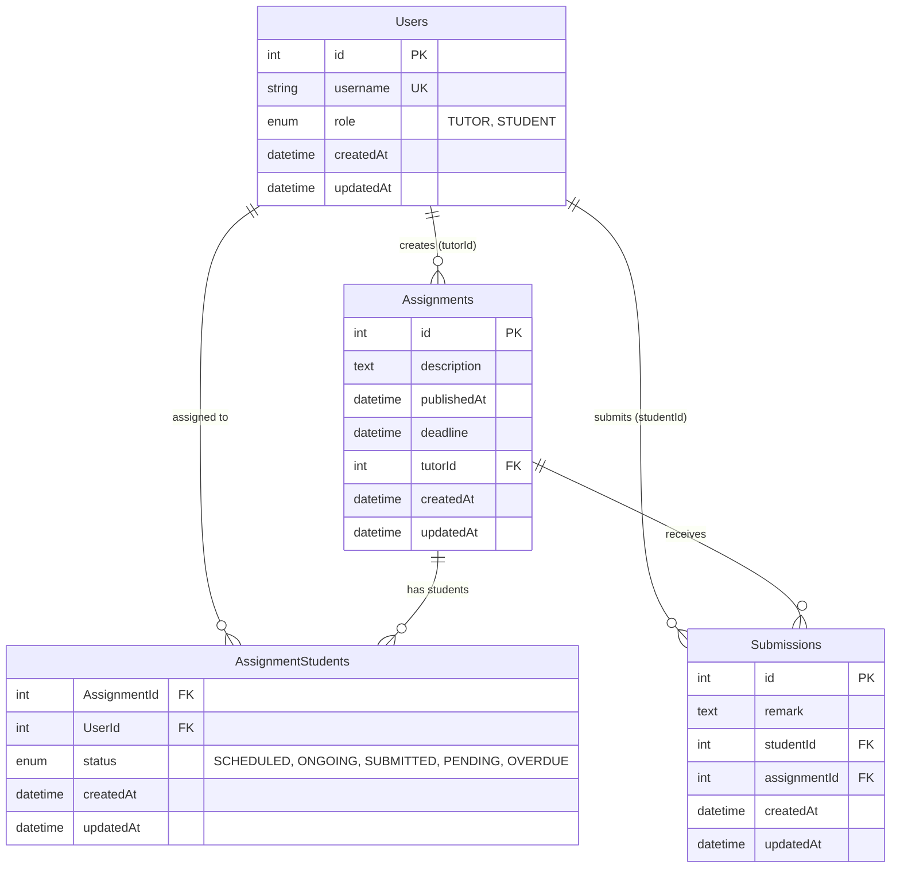

# Entity Relationship Diagram

## Virtual Classroom Database Schema



## Relationships

### 1. Users → Assignments (One-to-Many)
- **Relationship**: A tutor can create multiple assignments
- **Foreign Key**: `Assignments.tutorId` → `Users.id`
- **Constraint**: Only users with role 'TUTOR' can create assignments

### 2. Users ↔ Assignments (Many-to-Many)
- **Relationship**: Students can be assigned to multiple assignments, assignments can have multiple students
- **Junction Table**: `AssignmentStudents`
- **Foreign Keys**: 
  - `AssignmentStudents.AssignmentId` → `Assignments.id`
  - `AssignmentStudents.UserId` → `Users.id`
- **Additional Fields**: `status` to track assignment progress

### 3. Users → Submissions (One-to-Many)
- **Relationship**: A student can submit multiple assignments
- **Foreign Key**: `Submissions.studentId` → `Users.id`
- **Constraint**: Only users with role 'STUDENT' can submit

### 4. Assignments → Submissions (One-to-Many)
- **Relationship**: An assignment can receive multiple submissions
- **Foreign Key**: `Submissions.assignmentId` → `Assignments.id`
- **Constraint**: One submission per student per assignment

## Status Flow

```
Assignment Status Flow:
SCHEDULED → ONGOING → SUBMITTED
     ↓         ↓
   PENDING   OVERDUE

Where:
- SCHEDULED: Assignment publishedAt is in the future
- ONGOING: Assignment publishedAt has passed, deadline not reached
- PENDING: Student hasn't submitted yet (ONGOING status)
- OVERDUE: Deadline passed, no submission made
- SUBMITTED: Student has submitted the assignment
```

## Database Constraints

### Primary Keys
- `Users.id` (Auto-increment)
- `Assignments.id` (Auto-increment)
- `Submissions.id` (Auto-increment)
- `AssignmentStudents` (Composite: AssignmentId + UserId)

### Unique Constraints
- `Users.username` (Unique)
- `Submissions` (studentId + assignmentId) - One submission per student per assignment

### Foreign Key Constraints
- `Assignments.tutorId` → `Users.id` (CASCADE DELETE)
- `AssignmentStudents.AssignmentId` → `Assignments.id` (CASCADE DELETE)
- `AssignmentStudents.UserId` → `Users.id` (CASCADE DELETE)
- `Submissions.studentId` → `Users.id` (CASCADE DELETE)
- `Submissions.assignmentId` → `Assignments.id` (CASCADE DELETE)

### Check Constraints
- `Users.role` IN ('TUTOR', 'STUDENT')
- `AssignmentStudents.status` IN ('SCHEDULED', 'ONGOING', 'SUBMITTED', 'PENDING', 'OVERDUE')
- `Assignments.deadline` > `Assignments.publishedAt`

## Indexes

### Performance Indexes
```sql
-- User lookup by username
CREATE INDEX idx_users_username ON Users(username);

-- Assignment lookup by tutor
CREATE INDEX idx_assignments_tutor ON Assignments(tutorId);

-- Assignment lookup by publication date
CREATE INDEX idx_assignments_published ON Assignments(publishedAt);

-- Assignment lookup by deadline
CREATE INDEX idx_assignments_deadline ON Assignments(deadline);

-- Submission lookup by student
CREATE INDEX idx_submissions_student ON Submissions(studentId);

-- Submission lookup by assignment
CREATE INDEX idx_submissions_assignment ON Submissions(assignmentId);

-- Assignment-Student relationship lookup
CREATE INDEX idx_assignment_students_assignment ON AssignmentStudents(AssignmentId);
CREATE INDEX idx_assignment_students_user ON AssignmentStudents(UserId);
CREATE INDEX idx_assignment_students_status ON AssignmentStudents(status);
```

## Sample Data

### Users
```sql
INSERT INTO Users (username, role) VALUES
('john_tutor', 'TUTOR'),
('jane_student', 'STUDENT'),
('bob_student', 'STUDENT'),
('alice_tutor', 'TUTOR');
```

### Assignments
```sql
INSERT INTO Assignments (description, tutorId, publishedAt, deadline) VALUES
('Math Homework - Algebra', 1, '2024-01-15 10:00:00', '2024-01-20 23:59:59'),
('Science Project - Physics', 1, '2024-01-16 09:00:00', '2024-01-25 23:59:59'),
('History Essay', 4, '2024-01-17 14:00:00', '2024-01-22 23:59:59');
```

### Assignment Students
```sql
INSERT INTO AssignmentStudents (AssignmentId, UserId, status) VALUES
(1, 2, 'SUBMITTED'),
(1, 3, 'ONGOING'),
(2, 2, 'ONGOING'),
(2, 3, 'ONGOING'),
(3, 2, 'SCHEDULED');
```

### Submissions
```sql
INSERT INTO Submissions (remark, studentId, assignmentId) VALUES
('I completed all the algebra problems with detailed solutions.', 2, 1);
```

## Query Examples

### Get all assignments for a tutor
```sql
SELECT a.*, COUNT(DISTINCT ast.UserId) as student_count
FROM Assignments a
LEFT JOIN AssignmentStudents ast ON a.id = ast.AssignmentId
WHERE a.tutorId = 1
GROUP BY a.id;
```

### Get all assignments for a student with status
```sql
SELECT a.*, ast.status
FROM Assignments a
JOIN AssignmentStudents ast ON a.id = ast.AssignmentId
WHERE ast.UserId = 2;
```

### Get assignment details with submissions (for tutor)
```sql
SELECT a.*, u.username as student_name, s.remark, s.createdAt as submitted_at
FROM Assignments a
LEFT JOIN AssignmentStudents ast ON a.id = ast.AssignmentId
LEFT JOIN Users u ON ast.UserId = u.id
LEFT JOIN Submissions s ON a.id = s.assignmentId AND u.id = s.studentId
WHERE a.id = 1;
```

### Get overdue assignments
```sql
SELECT a.*, u.username as student_name
FROM Assignments a
JOIN AssignmentStudents ast ON a.id = ast.AssignmentId
JOIN Users u ON ast.UserId = u.id
WHERE a.deadline < NOW() 
AND ast.status IN ('SCHEDULED', 'ONGOING')
AND u.role = 'STUDENT';
```
